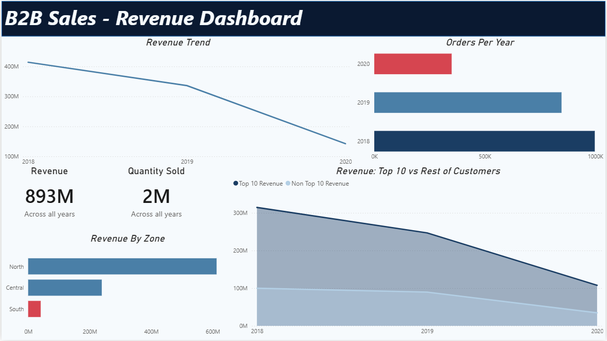
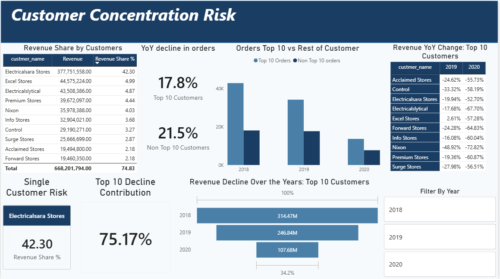

# Revenue Decline Root Cause Analysis

## Executive Summary

This project investigates the root cause of a significant revenue decline — a **₹7.8 Cr drop between 2018 and 2019** — for a B2B hardware and electronics supplier. While initial hypotheses pointed to seasonality or broad market weakness, a structured deep-dive using **SQL** and **Python** revealed a more specific and actionable cause: **86.9% of the revenue drop is directly attributable to reduced orders from just the Top 10 customers.**

The analysis demonstrates that this is a **customer concentration risk problem**, not a systemic market downturn. The business derives 73–77% of its annual revenue from a single-digit group of accounts, and a pullback from just four of them accounts for 77% of the total decline.

---

## Project Structure

The repository reflects a professional end-to-end data analysis pipeline — from raw data through cleaning, exploratory SQL analysis, Python deep-dive, and a business dashboard.

```
Revenue-Decline-Root-Cause-Analysis/
│
├── Data/
│   └── Raw_Data.sql                          # MySQL database dump (5 tables: customers,
│                                             # products, markets, transactions, date)
│
├── sql/
│   ├── 01_data_cleaning.sql                  # Data validation, anomaly removal, and
│   │                                         # currency normalization (USD → INR via views)
│   └── 02_revenue_decline_analysis.sql       # Exploratory analysis: YoY/QoQ revenue trends,
│                                             # product and customer-type breakdowns,
│                                             # individual account-level quarterly patterns,
│                                             # and customer concentration quantification
│
├── notebooks/
│   └── 03_customer_concentration_analysis.ipynb  # Python deep-dive: Top 10 isolation,
│                                                  # YoY/QoQ contribution analysis, order
│                                                  # volume investigation, and customer
│                                                  # risk scoring (Critical/Safe/Monitor/Growth)
│
├── report/
│   ├── Revenue_Decline_RCA.pbix              # Power BI dashboard (2 report pages,
│   │                                         # see Dashboard section below)
│   └── screenshots/
│       ├── Revenue_Dashboard.png             # Page 1 preview
│       └── customer_concentration.png        # Page 2 preview (full-period view)
│
└── README.md
```

---

## Tech Stack

| Tool | Role |
|---|---|
| **MySQL 8.0** | Data storage, cleaning (via views), and exploratory analysis |
| **Python 3 — Pandas, SQLAlchemy** | Data manipulation, concentration quantification, risk scoring |
| **Power BI** | Executive-facing dashboard and data visualisation |

---

## Dashboard

The Power BI dashboard (`report/Revenue_Decline_RCA.pbix`) translates the analysis findings into two report pages.

---

### Page 1 — B2B Sales: Revenue Dashboard



A high-level executive overview covering the full 2018–2020 period:

- **Revenue Trend** — a continuous line chart showing the decline from ₹414M (2018) to ₹134M (2020), making the steepening contraction visible at a glance
- **KPI Cards** — ₹893M total revenue and 2M units sold across all years, providing scale context
- **Orders Per Year** — a horizontal bar chart with 2020 highlighted in red to signal the partial-year anomaly and steepest drop
- **Revenue by Zone** — North zone dominates at ~₹600M, followed by Central and a negligible South contribution, surfacing a secondary geographic concentration risk
- **Revenue: Top 10 vs Rest of Customers** — a stacked area chart (2018–2020) showing the Top 10 line collapsing far faster than the Non-Top 10 line, visually anchoring the core finding

---

### Page 2 — Customer Concentration Risk



A focused drill-down on the concentration finding, filterable by year (2018 / 2019 / 2020):

- **Revenue Share by Customers** — a ranked table of the Top 10 accounts. Electricalsara Stores alone holds a **42.30% revenue share** (₹377M), a single-account risk that the "Single Customer Risk" card calls out explicitly
- **YoY Decline in Orders** — KPI cards showing a **17.8% order decline for Top 10** customers and a 21.5% decline for non-Top 10, confirming the volume-driven nature of the problem
- **Orders: Top 10 vs Rest of Customers** — a grouped bar chart comparing order volumes in 2018, 2019, and 2020 for both segments
- **Revenue YoY Change: Top 10 Customers** — a table breaking down each named account's % revenue change in 2019 and 2020. Nixon shows the steepest 2019 decline at –48.92%, with every account in the red
- **Top 10 Decline Contribution** — a large-format KPI card: **75.17%** of total revenue decline is attributable to the Top 10 group
- **Revenue Decline Over the Years: Top 10 Customers** — a horizontal bar chart (2018: ₹314M → 2019: ₹247M → 2020: ₹108M) with a 34.2% total contraction marker

---

## Key Findings

**1. It's a Concentration Problem, Not Seasonality**
The Top 10 customers account for 73–77% of total annual revenue in every year on record. Their reduced purchasing behaviour is the single dominant driver of the 2019 revenue decline — not time-of-year patterns. YoY quarterly comparisons show the Top 10 explain between 72% and 119% of the decline across all four quarters.

**2. Four Accounts Are Responsible for 77% of the Decline**
Within the Top 10, a "Critical-tier" subset — accounts combining a revenue share above 3% with a year-on-year decline exceeding ₹10L — accounts for 77% of the total ₹7.8 Cr drop. These customers are identifiable by name. This is not a diffuse problem; it is concentrated in a small, known group.

**3. Volume Collapsed, Not Just Basket Size**
Top 10 customer order volume fell by **24.3% year-on-year** between 2018 and 2019. The revenue decline is driven by customers purchasing less frequently, not simply spending less per order. This distinction matters for the commercial response.

**4. The Market Itself Is Not the Problem**
While Top 10 customers pulled back, non-Top 10 revenue grew by **₹25 lakhs in Q3 2019** — the one quarter where the trend is unambiguous. Broad demand from smaller accounts remains healthy, ruling out a sector-wide downturn as the cause.

---

## Strategic Recommendations

**Immediate: Account-level retention for Critical-tier customers**
Four accounts are responsible for 77% of the revenue decline and are known by name. The first action should be targeted commercial conversations with these accounts — pricing reviews, contract renewals, or service assessments — before any broader initiative is launched.

**Short-term: Investigate the order volume drop**
A 24.3% decline in order count from the Top 10 requires a qualitative explanation that transaction data alone cannot provide. Sales team feedback, CRM data, or customer surveys are needed to distinguish between: customers shifting to a competitor, reducing their own operations, or renegotiating terms. The right retention response differs significantly depending on the answer.

**Medium-term: Deliberate investment in the non-Top 10 base**
The non-Top 10 segment is currently absorbing some of the concentration risk through organic growth. This is a structural opportunity, not just a fallback. A diversification strategy — lower the revenue share of the single largest account from ~41% to a healthier ceiling — reduces the business's exposure to any single customer's purchasing decisions.

---

## Data Notes & Limitations

- The dataset covers transactions from **2017 to mid-2020**. 2017 contains only Q4 data and 2020 contains only H1 data; both years are excluded from YoY comparisons.
- Two anomalous market codes (097 — New York, 999 — Paris) appear in the `markets` table but have no corresponding transactions and are excluded via the `markets_clean` view.
- Bhopal appears under two market codes (007 and 013) with 13,228 and 96 records respectively. Both are retained on the assumption that the city has two separate distribution points.
- A fixed exchange rate of **₹89 per USD** is applied to all USD-denominated transactions. This is a simplification; historical rate variation is not modelled.
- There is no visibility into *why* top customers reduced their orders — no CRM records, contract terms, or competitor data are available in this dataset. The quantitative findings here should be paired with qualitative account-level investigation.

---

## How to Reproduce

**Requirements:** MySQL 8.0+, Python 3.8+, Power BI Desktop

```bash
# 1. Clone the repository
git clone https://github.com/syLvester03/Revenue-Decline-Root-Cause-Analysis.git

# 2. Load the raw data into MySQL
mysql -u root -p < Data/Raw_Data.sql

# 3. Run the cleaning and analysis scripts in order
mysql -u root -p sales < sql/01_data_cleaning.sql
mysql -u root -p sales < sql/02_revenue_decline_analysis.sql

# 4. Install Python dependencies
pip install pandas sqlalchemy pymysql

# 5. Open the notebook
jupyter notebook notebooks/03_customer_concentration_analysis.ipynb
# Update the DB connection string in cell 2 with your MySQL credentials

# 6. Open the dashboard
# Open Dashboard/Revenue_Decline_RCA.pbix in Power BI Desktop
```
