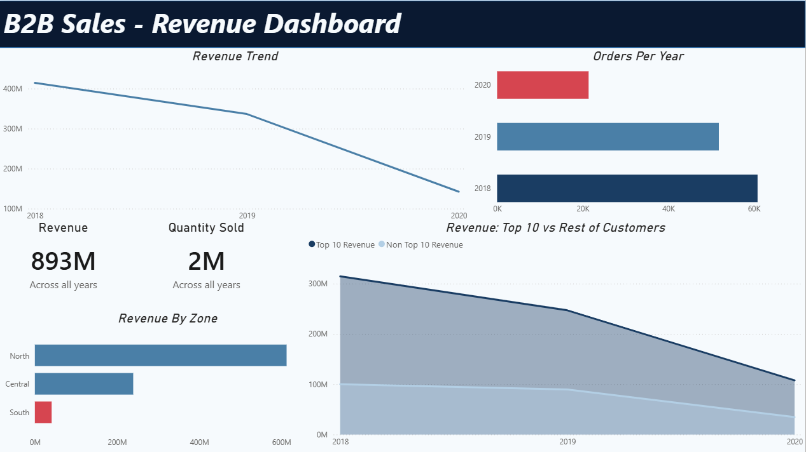
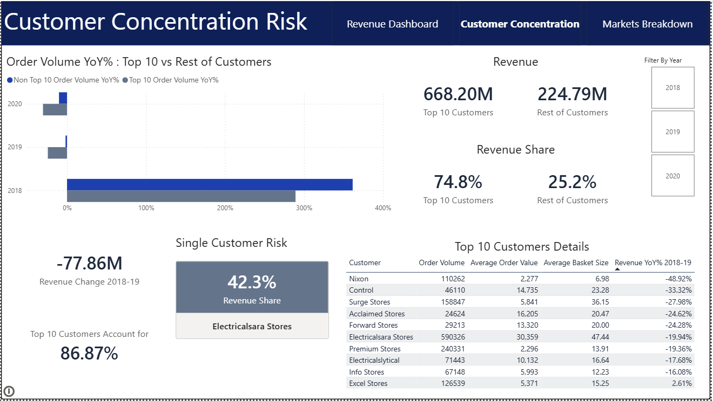
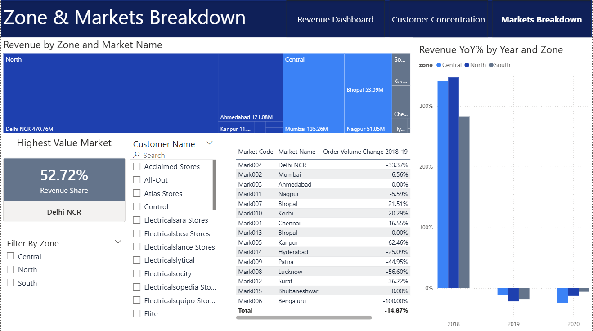

# Revenue Decline Root Cause Analysis

## Executive Summary

This project investigates the root cause of a significant revenue decline(**₹7.8 Cr drop between 2018 and 2019**) for a B2B hardware and electronics supplier. While initial hypotheses pointed to seasonality or broad market weakness, a structured deep-dive using **SQL** and **Python** revealed a more specific and actionable cause: **86.9% of the revenue drop is directly attributable to reduced orders from just the Top 10 customers.**

The analysis demonstrates that this is a **customer concentration risk problem**, not a systemic market downturn. The business derives 73–77% of its annual revenue from ten accounts, and a pullback from just six of them accounts for 77% of the total decline. A follow-up geographic analysis confirms this isn't abstract: these accounts are concentrated in specific markets, and their pullback explains revenue patterns across those markets directly. Delhi NCR alone represents 52.72% of total company revenue and declined 22% over the same period, while two markets — Hyderabad and Kochi — show genuine organic revenue growth independent of this risk and represent concrete diversification targets.

---

## Project Structure

The repository reflects a professional end-to-end data analysis pipeline — from raw data through cleaning, exploratory SQL analysis, a Python deep-dive (customer concentration → RFM segmentation → geographic concentration), and a business dashboard.

```
Revenue-Decline-Root-Cause-Analysis/
│
├── Data/
│   ├── Raw_Data.sql                          # MySQL database dump (5 tables: customers,
│   │                                          # products, markets, transactions, date)
│   └── rfm_segmentation.csv                  # Customer RFM segments (generated by
│                                              # 04_RFM_analysis.ipynb, consumed by 05)
│
├── sql/
│   ├── 01_data_cleaning.sql                  # Data validation, anomaly removal, and
│   │                                          # currency normalization (USD → INR via views)
│   └── 02_revenue_decline_analysis.sql       # Exploratory analysis: YoY/QoQ revenue trends,
│                                              # product and customer-type breakdowns,
│                                              # individual account-level quarterly patterns,
│                                              # customer concentration quantification, and
│                                              # zone/market-level revenue concentration
│
├── notebooks/
│   ├── 03_customer_concentration_analysis.ipynb  # Python deep-dive: Top 10 isolation,
│   │                                              # YoY/QoQ contribution analysis, order
│   │                                              # volume significance testing, and customer
│   │                                              # risk scoring (Critical/Safe/Monitor/Growth)
│   ├── 04_RFM_analysis.ipynb                     # Customer segmentation via RFM (frequency &
│   │                                              # monetary quartile scores + YoY trend),
│   │                                              # producing rfm_segmentation.csv
│   └── 05_market_concentration.ipynb             # Geographic deep-dive: zone/market revenue
│                                                  # concentration, significance testing, and
│                                                  # RFM-segment cross-reference explaining
│                                                  # market-level patterns
│
├── report/
│   ├── Revenue_Decline_RCA.pbix              # Power BI dashboard (3 report pages,
│   │                                         # see Dashboard section below)
│   └── screenshots/
│       ├── Revenue_Dashboard.png             # Page 1 preview
│       ├── customer_concentration.png        # Page 2 preview
│       └── zone_markets_breakdown.png        # Page 3 preview
│
└── README.md
```

**Pipeline order:** `01` cleans the raw data and produces the `*_clean` views used by everything downstream. `02` is the exploratory SQL layer and feeds both the customer-side analysis (`03`) and the market-side analysis (`05`). `04` depends only on `02`'s cleaned data and produces `rfm_segmentation.csv`, which `05` consumes — so `04` must be run before `05`.

---

## Tech Stack

| Tool | Role |
|---|---|
| **MySQL 8.0** | Data storage, cleaning (via views), and exploratory analysis |
| **Python 3 — Pandas, SQLAlchemy** | Data manipulation, concentration quantification, RFM segmentation, risk scoring |
| **SciPy (stats)** | Hypothesis testing (Welch's t-test and Mann-Whitney U) to validate the significance of YoY changes in order value, basket size, and order volume |
| **Power BI** | Executive-facing dashboard and data visualisation |

---

## Dashboard

The Power BI dashboard (`report/Revenue_Decline_RCA.pbix`) translates the analysis into three report pages, moving from high-level trend to customer-level concentration to geographic footprint.

---

### Page 1 — B2B Sales: Revenue Dashboard



A high-level executive overview of the full 2018–H1 2020 period. The page is unfiltered and intended to establish scale and surface the anomaly before the drill-down pages explain it.

- **Revenue Trend** — a quarterly line chart running from Q1 2018 to Q2 2020, making the pace and continuity of the contraction visible without annual aggregation masking within-year variation. The chart ends at Q2 2020 — the dataset covers H1 2020 only, and the quarterly axis makes the truncation self-evident without requiring an annotation.
- **KPI Cards** — ₹893M total revenue, 134K total order volume, and –9.0K order volume change 2018–19. The order volume change card sits alongside the total to immediately signal that the revenue problem is a volume problem, not a pricing or product-mix problem.
- **Revenue YoY%** — a bar chart showing year-on-year revenue change by year. The 2018 bar appears outsized (~300%+) because the base year is Q4 2017 only — a dataset boundary artifact, not genuine growth. The 2019 and 2020 bars reflect the real contraction.
- **Order Volume: Top 10 vs Other Customers** — a stacked area chart showing quarterly order volume for the Top 10 and the rest from 2018 to H1 2020. The Top 10 line collapses significantly faster, visually anchoring the core finding before the viewer reaches Page 2.
- **Top 10 Customers** — a table ranked by revenue share. Electricalsara Stores leads at 42.3%, with the remaining nine ranging from 2.2% to 5.0%. The table makes the concentration immediately legible: one account controlling 42.3% of revenue is a standalone business risk, independent of the 74.8% group figure.

---

### Page 2 — Customer Concentration Risk



A drill-down on the concentration finding. The revenue KPI cards (668.20M, 224.79M, 74.8%, 25.2%) and the two headline cards below them reflect the full 2018–2020 period and are not affected by the year slicer. The bar chart and customer table respond to the slicer, allowing year-specific behaviour to be isolated.

- **Revenue KPIs** — Top 10 total revenue (668.20M) and Rest of Customers (224.79M), with revenue share (74.8% / 25.2%). These establish the structural imbalance as a baseline before examining the decline.
- **Order Volume YoY%: Top 10 vs Rest** — a bar chart comparing year-on-year order volume change for both groups across 2018, 2019, and 2020. The 2018 spike is the same partial-year artifact as Page 1. The 2019 bars show the Top 10 contracting while the rest holds relatively steady — the same pattern as the area chart on Page 1, now expressed as a percentage.
- **Revenue Decline 2018–19 / Top 10 Account for 86.9%** — two KPI cards paired intentionally. The upper card (–77.86M) states the total revenue drop; the lower (86.9%) attributes the cause. Together they answer "how bad?" and "who caused it?" without requiring the viewer to read a table first.
- **Single Customer Risk** — a callout card isolating Electricalsara Stores at 42.3% revenue share. One account at 42.3% is a concentration risk that would exist even without the broader Top 10 finding.
- **Customer Table** — the Top 10 accounts sorted by Revenue YoY% 2018–19 (worst first), with Order Volume, Average Order Value, and Average Basket Size alongside the decline percentage. Nixon leads the decline at –48.92% despite being a mid-tier account by volume, which the sort surfaces immediately. Electricalsara Stores sits at –19.94% — a smaller percentage than Nixon, but its absolute revenue impact dwarfs every other account due to its size. Excel Stores is the single exception at +2.61%, a signal that becomes a key finding on Page 3.
- **Filter By Year** — a slicer (2018 / 2019 / 2020) that updates the bar chart and customer table, enabling isolation of any single year's customer behaviour.

---

### Page 3 — Zone & Markets Breakdown



The geographic layer of the analysis. The Customer Name and Filter By Zone slicers are bidirectional — filtering by customer updates the tree map and table to show that customer's markets and order volume changes; filtering by zone updates the Highest Value Market card to show the dominant market within that zone. The page can answer questions as narrow as "which specific markets did Nixon pull back from, and by how much?" — enabling direct attribution of geographic revenue patterns to individual accounts.

- **Revenue by Zone and market_name** — a treemap where rectangle area is proportional to revenue, making the geographic imbalance impossible to miss at a glance. North's block occupies more than half the entire chart, and within it Delhi NCR's 470.76M tile dwarfs every other market in the business. Central's three main markets (Mumbai 135.26M, Ahmedabad 121.08M, Nagpur 51.05M, Bhopal 53.09M) are legible but clearly secondary. South is reduced to a thin column of truncated labels on the right edge — an accurate visual representation of its revenue contribution relative to the rest of the business.
- **Single Market Concentration** — a KPI card showing Delhi NCR at 52.72% revenue share in the unfiltered state. Applying the Filter By Zone slicer shifts this to the highest-revenue market within the selected zone, making the card reusable across geographic scopes.
- **Market Table** — markets sorted by revenue, showing Order Volume Change 2018–19. Delhi NCR leads at –33.37%. The table is most analytically powerful in combination with the Customer Name slicer: selecting a specific account shows exactly which markets that account operated in and how their order volume changed, enabling direct attribution of the geographic decline to individual customers.
- **Revenue YoY% by Year and Zone** — a clustered bar chart showing zone-level revenue change for 2018, 2019, and 2020. The 2018 bars reflect the same partial-year base as Pages 1 and 2. The 2019 and 2020 bars show North declining most sharply in absolute terms, consistent with Delhi NCR's dominance and the pullback of the Critical-tier accounts concentrated there.

---

## Key Findings

**1. It's a Concentration Problem, Not Seasonality**
The Top 10 customers account for 73–77% of total annual revenue in every year on record. Their reduced purchasing behaviour is the single dominant driver of the 2019 revenue decline, not time-of-year patterns. YoY quarterly comparisons show the Top 10 explain between 72% and 119% of the decline across all four quarters.

**2. Six Accounts Are Responsible for 77% of the Decline**
Within the Top 10, a "Critical-tier" subset of six accounts (Electricalsara Stores, Electricalslytical, Premium Stores, Nixon, Info Stores, and Control) account for 77% of the total ₹7.8 Cr drop. These customers are identifiable by name. This is not a diffuse problem; it is concentrated in a small, known group.

**3. Volume Collapsed, Not Just Basket Size**
Top 10 customer order volume fell by **24.3% year-on-year** between 2018 and 2019. A decline confirmed as highly statistically significant by a Mann-Whitney U test (U = 138.0, p = 0.0000779). The revenue decline is driven by customers purchasing less frequently, not simply spending less per order. This distinction matters for the commercial response.

**4. The Market Itself Is Not the Problem**
While Top 10 customers pulled back, non-Top 10 revenue grew by **₹25 lakhs in Q3 2019** — the one quarter where the trend is unambiguous. Broad demand from smaller accounts remains healthy, ruling out a sector-wide downturn as the cause.

**5. The Concentration Risk Has a Geographic Footprint**
North zone holds 68.6% of total revenue, and within it, Delhi NCR alone — a single market — accounts for **52.72% of the company's entire revenue**. Delhi NCR's revenue declined 22.4% between 2018 and 2019, and 4 of its 5 active customers are RFM-flagged **"High Value - At Risk,"** overlapping directly with the Critical-tier accounts above. The same pattern repeats in South at a smaller scale: Chennai's 42.9% decline and Bengaluru's collapse to zero revenue (from ~₹3.7L in 2018) both trace to "High Value - At Risk" accounts, Surge Stores and Electricalsara Stores respectively. The decline isn't a North problem or a South problem; it's one small group of accounts whose pullback has a geographic footprint across both zones.

**6. Hyderabad and Kochi Are Concrete Diversification Targets**
Independent of the at-risk account cohort, two South markets show genuine organic revenue growth: Hyderabad (+14.4% YoY revenue, anchored by Excel Stores — the only "Champion"-segment account among the company's top-tier customers) and Kochi (+5.6% YoY). Critically, both markets achieved revenue growth despite a decline in order volume, average order value increased enough in both markets to more than offset fewer orders, pointing to higher-value purchasing behaviour rather than a volume-dependent relationship. This makes them structurally different from the declining markets and gives the diversification recommendation below concrete, evidence-backed targets.

---

## Strategic Recommendations

**Immediate: Account-level retention for Critical-tier customers**
Six accounts — Electricalsara Stores, Electricalslytical, Premium Stores, Nixon, Info Stores, and Control — combine a revenue share above 3% with a year-on-year revenue decline exceeding ₹10L, and together are responsible for 77% of the total revenue drop. The first action should be targeted commercial conversations with these accounts — pricing reviews, contract renewals, or service assessments — before any broader initiative is launched. Their impact is also geographically traceable: these accounts (and others sharing their "High Value - At Risk" RFM segment) are concentrated in Delhi NCR, Chennai, Bhubaneshwar, and Bengaluru, giving the business a way to measure whether retention efforts are working by tracking revenue recovery in those specific markets.

**Short-term: Investigate the order volume drop**
A 24.3% decline in order count from the Top 10 — confirmed highly significant by a Mann-Whitney U test (p < 0.0001) — requires a qualitative explanation that transaction data alone cannot provide. Sales team feedback, CRM data, or customer surveys are needed to distinguish between: customers shifting to a competitor, reducing their own operations, or renegotiating terms. The right retention response differs significantly depending on the answer.

**Medium-term: Deliberate investment in the non-Top 10 base**
The non-Top 10 segment is currently absorbing some of the concentration risk through organic growth. This is a structural opportunity, not just a fallback. A diversification strategy — lowering the revenue share of the single largest account from ~42% toward a healthier ceiling — reduces the business's exposure to any one customer's purchasing decisions. Hyderabad (+14.4% YoY revenue growth driven by rising order values, not just volume, anchored by a stable "Champion" account) and Kochi (+5.6% YoY, the most customer-diversified market in South) are concrete, evidence-backed candidates for this investment.

---

## Data Notes & Limitations

- The dataset covers transactions from **2017 to mid-2020**. 2017 contains only Q4 data and 2020 contains only H1 data; both years are excluded from YoY comparisons. The outsized 2018 Revenue YoY% bar visible in the dashboard reflects comparison against this partial 2017 base and should not be read as genuine growth.
- Two anomalous market codes (097 — New York, 999 — Paris) appear in the `markets` table but have no corresponding transactions and are excluded via the `markets_clean` view.
- Bhopal appears under two market codes (007 and 013) with 13,228 and 96 records respectively. Both are retained on the assumption that the city has two separate distribution points.
- The `custmer_name` column is misspelled in the source database schema (missing an "o"). This is preserved as-is throughout the SQL and Python code for consistency with the underlying tables.
- Bengaluru (South zone) had ~₹3.7L in revenue in 2018 and ₹0 in 2019. Investigation traced this to incidental purchases by customers (Electricalsara Stores, Excel Stores) whose primary activity is in other markets — Bengaluru functioned as a minor secondary location for these accounts rather than an independent market, and its disappearance reflects those accounts' broader pullback rather than a standalone market failure.
- There is no visibility into *why* top customers reduced their orders — no CRM records, contract terms, or competitor data are available in this dataset. The quantitative findings here should be paired with qualitative account-level investigation.

---

## How to Reproduce

**Requirements:** MySQL 8.0+, Python 3.8+, Power BI Desktop

```bash
# 1. Clone the repository
git clone https://github.com/syLvester03/Revenue-Decline-Root-Cause-Analysis.git

# 2. Load the raw data into MySQL
mysql -u root -p < Data/Raw_Data.sql

# 3. Run the cleaning and analysis scripts in order
mysql -u root -p sales < sql/01_data_cleaning.sql
mysql -u root -p sales < sql/02_revenue_decline_analysis.sql

# 4. Install Python dependencies
pip install pandas numpy scipy sqlalchemy pymysql

# 5. Run the notebooks in order
#    - 03_customer_concentration_analysis.ipynb  (Top 10 / Critical-tier analysis)
#    - 04_RFM_analysis.ipynb                     (produces rfm_segmentation.csv)
#    - 05_market_concentration.ipynb             (geographic deep-dive)
#
# Update the DB connection string in each notebook with your MySQL credentials.
# Note: rfm_segmentation.csv is committed under Data/, but 04 writes it and 05
# reads it from the notebook's working directory — place a copy alongside the
# notebooks (or update the file path in both) before running 05.

# 6. Open the dashboard
# Open report/Revenue_Decline_RCA.pbix in Power BI Desktop
```
